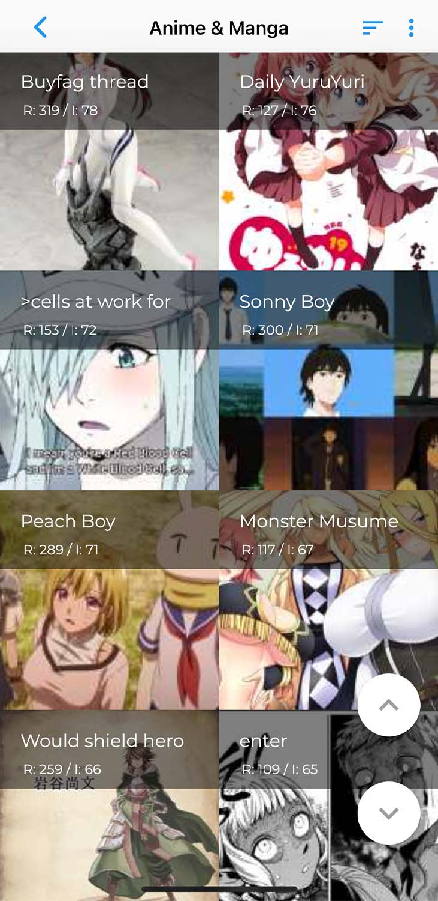
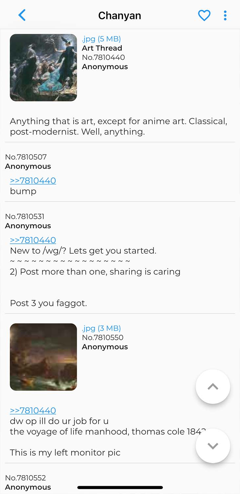

# Chanyan

## Website

[See all Features](https://chanyan.carrd.co/)

## Features

- Boards and threads that can be favorised 
- Boards in grid- or listview
- Sortable boards
- Fast video and image galery (Support for WebM on iOS)
- Downloadable images and Videos (WebMs will be converted to MP4)
- Download all images from one board
- Supporting Dark Mode

## Screenshots

  
  

### Gallery

## Testflight

If you want to test it on testflight just email [me](mailto:Marvin.Jaeckisch1@web.de) or use [this link](https://testflight.apple.com/join/ky5bRwMY) 

## License

Distributed under the GPL3 License. See [LICENSE](https://github.com/wrngwrld/Chanyan/blob/develop/LICENSE) for more information.
